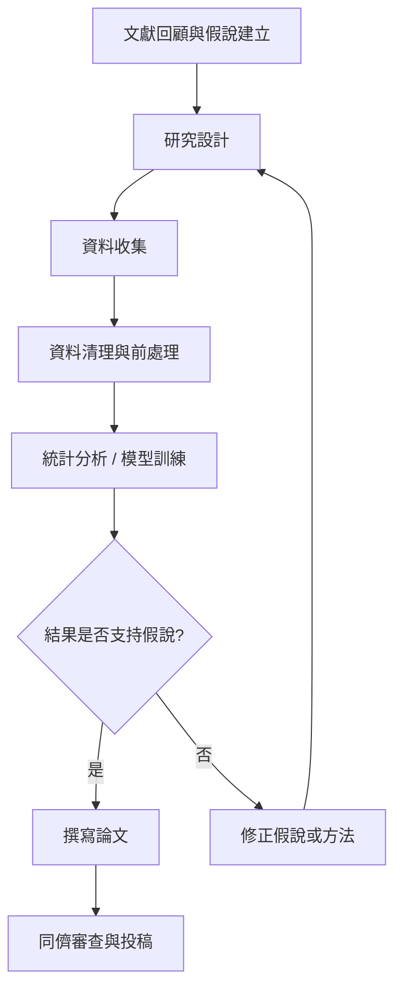

# Slidev 學術簡報指南

以 Markdown 驅動的新世代學術簡報工具

---
layout: chapter
---

# 簡介

---

## 為什麼學術簡報需要新工具？

傳統工具在學術場景的痛點

<v-clicks>

- **PowerPoint / Keynote**：公式排版困難，版本控制不易，多人協作靠檔案傳遞
- **LaTeX Beamer**：排版精準但語法繁瑣，修改成本高，互動性受限
- **Google Slides**：公式支援薄弱，代碼呈現粗糙，離線使用不便

</v-clicks>

<v-click>

<div class="mt-8 p-4 bg-blue-50 rounded-lg text-blue-900">
  <strong>Slidev 的定位：</strong>結合 Markdown 的簡潔、LaTeX 的公式能力、與網頁技術的互動性
</div>

</v-click>

---

## Slidev 是什麼？

由 Anthony Fu 開發的開源簡報框架（GitHub 38K+ Stars）

<div class="grid grid-cols-2 gap-8 mt-4">
<div>

#### 核心特色

- **Markdown 撰寫**：純文字，專注內容
- **即時預覽**：儲存即更新，所見即所得
- **Git 友善**：diff 可追蹤每次修改
- **主題生態**：npm 安裝，一鍵切換風格
- **匯出多格式**：PDF、PNG、PPTX

</div>
<div>

#### 技術基礎

- 基於 **Vue 3** + **Vite**
- 使用 **UnoCSS** 處理樣式
- 內建 **KaTeX** 渲染數學公式
- 支援 **Mermaid** 繪製圖表
- 支援 **Shiki** 代碼語法高亮

</div>
</div>

---
layout: chapter
---

# 學術應用

---

## 學術應用一：數學公式

內建 KaTeX，支援行內與區塊 LaTeX 語法

行內公式：歐拉恆等式 $e^{i\pi} + 1 = 0$，直接嵌在文字中。

區塊公式 — 貝葉斯定理：

$$
P(\theta \mid \mathbf{x}) = \frac{P(\mathbf{x} \mid \theta) \cdot P(\theta)}{P(\mathbf{x})}
$$

多行推導 — 最大概似估計：

$$
\hat{\theta}_{MLE} = \arg\max_{\theta} \prod_{i=1}^{n} f(x_i \mid \theta) = \arg\max_{\theta} \sum_{i=1}^{n} \ln f(x_i \mid \theta)
$$

<div class="mt-4 text-sm opacity-70">

撰寫方式：用 `$...$` 包裹行內公式，`$$...$$` 包裹區塊公式

</div>

---

### 學術應用二：代碼展示

語法高亮、行號標記、逐步揭示 — 適合方法論講解

```python {1-2|4-5|7-9|all}
# 資料前處理
from sklearn.preprocessing import StandardScaler

# 模型建構
from sklearn.ensemble import GradientBoostingClassifier

# 交叉驗證
from sklearn.model_selection import cross_val_score
scores = cross_val_score(model, X, y, cv=5, scoring='accuracy')
```

<v-click>

<div class="mt-4 p-3 bg-green-50 rounded text-green-900 text-sm">

**學術場景優勢**：逐步高亮讓聽眾跟著你的節奏理解每個步驟，不會一次看到整面代碼而迷失

</div>

</v-click>

---

### 學術應用：多語言代碼展示

Code Groups 提供分頁式代碼檢視 — 一張投影片呈現多語言範例

::code-group

```python [Python]
import statistics
data = [85, 92, 78, 95, 88]
print(f"平均數: {statistics.mean(data):.2f}")
print(f"標準差: {statistics.stdev(data):.2f}")
```

```bash [Shell]
echo "Hello from $(whoami)"
echo "Current directory: $(pwd)"
echo "Date: $(date)"
```

```r [R]
data <- c(85, 92, 78, 95, 88)
cat("平均值:", mean(data), "\n")
cat("標準差:", sd(data), "\n")
```

::

<div class="mt-4 text-sm opacity-70">

語法：用 `::code-group` 包裹多個 code block，每個加上 `[標籤名]` 即可

</div>

---

### 學術應用：互動式代碼編輯

在簡報中直接編輯並展示代碼 — 適合現場教學與 demo

```python {monaco-run} {autorun:false}
# 試試直接在這裡修改代碼，按 Run 執行！
import statistics

data = [85, 92, 78, 95, 88]

print(f"樣本數: {len(data)}")
print(f"平均數: {statistics.mean(data):.2f}")
print(f"標準差: {statistics.stdev(data):.2f}")
```

<div class="mt-4 text-sm opacity-70">

語法：在 code block 加上 `{monaco}` 即可啟用互動編輯器

</div>

---

### Demo: Shell 互動執行

在簡報中直接執行本機 Shell 指令

```bash {monaco-run} {autorun:false}
# 試試在這裡輸入任何 shell 指令！
echo "Hello from $(whoami)@$(hostname)"
echo "Current directory: $(pwd)"
echo "Date: $(date)"
```

<div class="mt-4 text-sm opacity-70">

使用本機 `/bin/bash` 環境，可執行任何 shell 指令

</div>

---

### Demo: R 語言互動執行

在簡報中直接執行 R 統計分析

```r {monaco-run} {autorun:false}
# 試試修改數據或分析方法！
data <- c(23, 45, 67, 32, 55, 78, 41)

cat("樣本數:", length(data), "\n")
cat("平均值:", mean(data), "\n")
cat("標準差:", sd(data), "\n")
cat("中位數:", median(data), "\n")
```

<div class="mt-4 text-sm opacity-70">

使用本機 `Rscript` 環境，支援所有已安裝的 R 套件

</div>

---

### 學術應用三：研究流程圖

用 Mermaid 語法直接以文字描述圖表，無需另開繪圖軟體



<div class="mt-2 text-sm opacity-70">

亦可繪製序列圖、甘特圖、類別圖等，適合展示系統架構或實驗流程

</div>

---

### 學術應用：數據圖表視覺化

使用 vue-chartjs 在投影片中直接嵌入互動式圖表

<div class="grid grid-cols-2 gap-4">
<div>

<ChartBar
  :labels="['Logistic', 'RF', 'SVM', 'XGBoost']"
  :datasets="[
    { label: 'AUC', data: [0.72, 0.85, 0.81, 0.91], backgroundColor: ['#8FC1C0', '#5B9A9C', '#3D6869', '#2A4A4B'] }
  ]"
  title="模型效能比較"
/>

</div>
<div>

<ChartRadar
  :labels="['Precision', 'Recall', 'F1', 'AUC', 'Speed']"
  :datasets="[
    { label: 'XGBoost', data: [88, 92, 90, 91, 70] },
    { label: 'Random Forest', data: [82, 85, 83, 85, 85] }
  ]"
  title="模型多維比較"
/>

</div>
</div>

<div class="mt-2 text-sm opacity-70">

使用 `<ChartBar>` 、 `<ChartLine>` 、 `<ChartPie>` 、 `<ChartRadar>` 等元件，透過 props 傳入資料即可

</div>

---

## 學術應用四：逐步揭示與動畫

控制資訊呈現的節奏，引導聽眾思考

#### 實驗結果

<v-clicks>

1. **基準模型** — Logistic Regression：AUC = 0.72
2. **改進模型** — Random Forest：AUC = 0.85
3. **最終模型** — XGBoost + 特徵工程：AUC = 0.91

</v-clicks>

<v-click>

<div class="mt-6 p-4 bg-amber-50 rounded-lg text-amber-900">

**效果**：每點一次，才出現下一個結果。聽眾不會直接跳到結論，而是跟著你的敘事邏輯一步步理解改進的過程。

</div>

</v-click>

---

### 學術應用五：版本控制與協作

slides.md 是純文字檔，天然適合 Git 工作流

<div class="grid grid-cols-2 gap-8 mt-4">
<div>

#### 學術場景

- 論文進度追蹤：每次修改留有紀錄
- 多人協作：Git branch + merge
- 投稿不同會議：各自一個 branch
- 歷史回溯：`git log` 查看演變過程

</div>
<div>

#### 對比 PowerPoint

- `.pptx` 是二進位檔，diff 無意義
- 協作靠「v2_final_final.pptx」
- 無法追蹤誰改了哪張投影片
- 合併修改容易衝突或覆蓋

</div>
</div>

<div class="mt-6 text-sm opacity-70">

搭配 GitHub / GitLab，還能用 CI/CD 自動建構 PDF 並部署為網頁簡報

</div>

---

### 學術應用六：匯出與分享

一份原始檔，多種輸出格式

| 格式 | 指令 | 適用場景 |
|------|------|----------|
| **網頁簡報** | `slidev` | 現場演講，支援互動與動畫 |
| **PDF** | `slidev export` | 投稿附件、寄給審查委員 |
| **PNG** | `slidev export --format png` | 嵌入論文或海報 |
| **PPTX** | `slidev export --format pptx` | 給只收 PPT 的場合應急 |
| **SPA 網站** | `slidev build` | 部署至 GitHub Pages 長期分享 |

<div class="mt-4 text-sm opacity-70">

PDF 匯出需安裝 `playwright-chromium`：`pnpm add -D playwright-chromium`

</div>

---
layout: chapter
---

# 實用技巧

---

## 演講者模式

專業演講的好幫手

<div class="grid grid-cols-2 gap-8 mt-4">
<div>

#### 演講者視窗提供

- 當前投影片 + 下一張預覽
- 演講備註（寫在 `<!-- 備註 -->` 中）
- 計時器
- 投影片導覽

</div>
<div>

#### 開啟方式

在簡報網址後加 `/presenter/`

```
http://localhost:3030/presenter/
```

亦可搭配手機遠端遙控：

```bash
slidev --remote
```

</div>
</div>

---

## 何時該用 Slidev？何時不該？

務實的選擇建議

<div class="grid grid-cols-2 gap-8 mt-4">
<div>

#### 推薦使用

- CS / 工程 / 資料科學領域
- 需要展示代碼或演算法
- 公式密集的數理簡報
- 重視版本控制的長期課程
- 想部署為線上簡報

</div>
<div>

#### 斟酌考慮

- 合作者不熟 Markdown / CLI
- 需要大量精細圖片排版
- 必須交 `.pptx` 且含動畫
- 純文字 / 人文學科簡報
- 時間緊迫且從未用過

</div>
</div>

<div class="mt-6 p-3 bg-gray-100 rounded text-sm">

**建議**：先在一場小型 lab meeting 試用，熟悉後再用於正式場合

</div>

---
layout: center
class: text-center
---

# 開始使用

```bash
pnpm create slidev@latest
```

<div class="mt-8 text-sm opacity-70">

[官方文件 sli.dev](https://sli.dev) · [GitHub](https://github.com/slidevjs/slidev) · [主題市集](https://sli.dev/resources/theme-gallery)

</div>

<div class="mt-4 text-xs opacity-40">

本簡報即以 Slidev 製作 — 身體力行，知行合一

</div>
